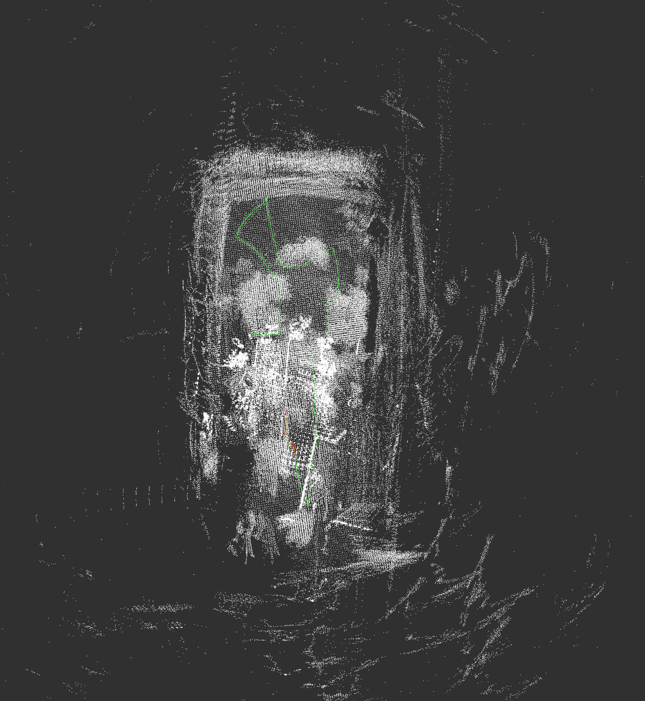

本次激光slam所使用的数据集来自[The HILTI SLAM Challenge](https://github.com/hemi86/hiltislamchallenge)

第一版(20211202)：
在我实现的初版中，使用对应的面特征来求解里程计的变换（这里使用ceres作为求解工具）。同时使用了gtsam作为后端优化，但是看起来貌似没有效果。可能是使用方法上有问题，之后会继续研究。
